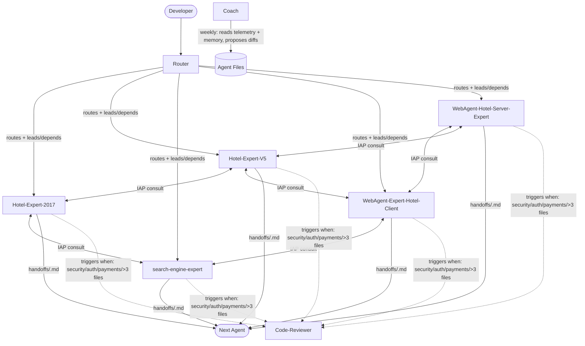

# Issta Copilot Setup

Installs this repository's shared Copilot workspace into `~/.copilot`.

## Architecture (v2)



**3 layers:**

1. **Entry** — `Router` classifies and dispatches to one or two experts (lead + dependent). Never implements.
2. **Experts** (5 agents) — each owns a strict domain slice. Can read/search/edit/execute, consult a peer via IAP (one call, depth-1), and hand off via `handoffs/<slug>.md`.
3. **Support** — `Code-Reviewer` triggered conditionally (security/payments/large diffs). `Coach` runs weekly, proposes agent improvements from telemetry.

## What gets installed

- `agents/` — Router + 5 specialists + Code-Reviewer + Coach (common-block injected on install)
- `skills/` — issta-stack, angular-patterns, dotnet-clean-arch, gimmonix-adapter, gtm-ga4-tracking, owasp-security
- `memory/` — domain insight files + telemetry.log
- `help-docs/`
- `copilot-instructions.md`

## How coworkers should run it

```bash
# From npm (after publish)
npx issta-copilot-setup

# From GitHub directly
npx github:giladme-issta/Issta-agents-package
```

## Publish checklist

1. Sign in to the npm registry.
2. `npm publish` from the repository root.
3. Share `npx issta-copilot-setup` with coworkers.
